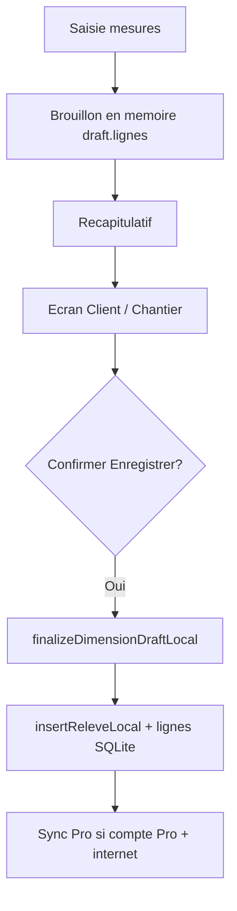

# Ajout d'un champ note à la table releve
_Exported on 6/2/2026 at 21:40:39 GMT from Cursor (3.6.31)_

---

**User**

Ajoute un champ note a la table releve, local et supabase

---

**Cursor**

Je vais repérer où la table `releve` est définie en local et dans Supabase, puis y ajouter le champ `note`.


Ajout du champ `note` sur `releves` : schéma local, migration Supabase, sync et admin.


Le champ `note` (TEXT, nullable) est ajouté sur la table `releves` partout où le schéma est défini.

### SQLite local (`localDb.js`)
- Colonne `note TEXT` dans le `CREATE TABLE releves`
- Migration `ALTER TABLE releves ADD COLUMN note TEXT` pour les bases déjà installées (au prochain démarrage de l’app)

### Supabase
- `supabase/schema.sql` — colonne `note TEXT` sur `releves`
- Migration `supabase/migrations/20260602120000_releves_note.sql`

### Sync & admin
- `terrainSync.js` — `note` inclus dans les colonnes synchronisées
- `AdminScreen.js` — champ éditable dans l’interface admin web

`insertReleveLocal` n’a pas été modifié : `note` reste `NULL` par défaut à la création. La sync terrain (`select('*')`) récupérera la colonne une fois la migration Supabase appliquée.

Pour appliquer côté Supabase :

```bash
supabase db push
```

ou exécuter manuellement :

```sql
ALTER TABLE releves ADD COLUMN IF NOT EXISTS note TEXT;
```

---

**User**

met a jour l ecran admin avec le nouveau champ

---

**Cursor**

Je vais parcourir l'écran admin pour voir comment les champs sont définis et affichés, puis y intégrer `note` sur `releves`.


Le champ `note` est déjà dans le schéma ; j'améliore l'écran admin : saisie multiligne et affichage dans la liste des relevés.


L’écran admin est à jour pour le champ `note` sur **Relevés**.

### Schéma (`TABLE_SCHEMAS.releves`)
- Champ `note` (TEXT), saisie **multiligne** via `isMultiline: true`

### Liste des relevés
- Titre : client / chantier, avec un extrait de la note si elle existe
- Sous-titre : texte complet de la note (tronqué), ou l’`id` s’il n’y a pas de note

### Formulaire & détails
- Zone de texte multiligne (4 lignes) pour `note` à la création / modification
- Affichage des retours à la ligne dans le panneau Détails

Le champ `note` des **ligne_releves** utilise aussi `isMultiline` pour rester cohérent.

Pense à appliquer la migration Supabase (`releves.note`) si ce n’est pas déjà fait, sinon la sauvegarde échouera côté cloud.

---

**User**

@prompts_2.txt (89-92) 

---

**Cursor**

Je vais repérer toutes les utilisations de `ind_unitaire`, les retirer du schéma local et Supabase, puis adapter le frontend et les calculs de quantité selon `ind_dimension` seul.


Je supprime `ind_unitaire` partout et simplifie la logique de calcul autour de `ind_dimension` seul.


`ind_unitaire` a été retiré partout. La quantité ne dépend plus que de `ind_dimension`.

### Règles de calcul (`ligneReleveCalcul.js`)
| `ind_dimension` | Comportement |
|---|---|
| **0** | Quantité unitaire → `quantité = n` |
| **1** | Calcul selon `formule` (ex. `l×h×n`), cotes en cm converties en m |

L’ancien cas « dimensions saisies mais `quantité = n` » (quand `ind_unitaire = 1` et `ind_dimension = 1`) n’existe plus : dès que `ind_dimension = 1`, la formule s’applique.

### Base de données
- **SQLite** : colonne retirée du schéma + `ALTER TABLE unites DROP COLUMN ind_unitaire` au démarrage
- **Supabase** : `schema.sql` mis à jour + migration `supabase/migrations/20260602130000_unites_drop_ind_unitaire.sql`

### Frontend / sync
- `PaveSaisieOneHand`, `App.js`, `NouvelleDimensionScreen` : prop `isUnitaire` supprimée
- `querries.js`, `terrainSync.js`, `AdminScreen.js` : plus de lecture/écriture de `ind_unitaire`

### À faire côté Supabase
```bash
supabase db push
```

Puis **re-télécharger** les données sur le mobile (sync) pour aligner les unités locales.

**Note données existantes** : les unités qui avaient `ind_dimension = 1` et `ind_unitaire = 1` utiliseront désormais la formule au lieu de `n` seul. Si certaines devaient rester « au nombre », passez-les à `ind_dimension = 0` dans l’admin.

---

**User**

@errors.txt (38-40) 

---

**Cursor**

L'erreur indique que la colonne `ind_unitaire` existe encore en local avec une contrainte NOT NULL. Je vérifie la migration SQLite et corrige la suppression de cette colonne.


Le `DROP COLUMN` a probablement échoué silencieusement : la colonne `ind_unitaire` reste en NOT NULL alors que la sync n'envoie plus cette valeur. J'ajoute une migration SQLite plus robuste (recréation de table si besoin).


La cause : sur ton téléphone, la table `unites` avait encore la colonne `ind_unitaire` (NOT NULL), alors que la sync n’envoie plus cette valeur depuis la mise à jour. Le `ALTER TABLE … DROP COLUMN` avait probablement échoué sans bloquer l’app (dans un `try/catch`).

### Correctif
Une migration plus robuste dans `localDb.js` :
1. Vérifie si `ind_unitaire` existe encore (`PRAGMA table_info`)
2. Tente `DROP COLUMN`
3. Si la colonne est toujours là → recrée la table `unites` sans `ind_unitaire` (en copiant les données), avec `PRAGMA foreign_keys = OFF` le temps de l’opération

### À faire
1. **Redémarrer complètement l’app** (fermer Expo Go / l’app, pas seulement recharger le JS)
2. Relancer une **sync / téléchargement** des données

L’erreur `NOT NULL Constraint failed: unites.ind_unitaire` devrait disparaître.

Si elle persiste après un redémarrage complet, dis-le : on pourra envisager de réinitialiser la base locale (`losange_final.db`) en dernier recours.

---

**User**

@prompts_2.txt (95-98) 

---

**Cursor**

Je vais repérer où détails, récap et devis affichent qté et prix unitaire pour `ind_dimension`, puis aligner l’affichage sur les règles demandées.


J'ajoute des helpers d'affichage et je les branche sur les cartes (détails/récap) et le devis.


Affichage aligné sur `ind_dimension` pour récap, détails et devis. Les valeurs en base (`quantite`, `prix_unitaire_applique`, `montant`) ne changent pas.

### `ind_dimension = 1` (mesure dimensionnée)

| Zone | Affichage | Données utilisées pour les totaux |
|------|-----------|-----------------------------------|
| **Qté** (cartes + devis) | **n** (nombre) | `quantite` (inchangée en base) |
| **P.U.** (détails avec prix + PDF devis) | **montant** de la ligne | `prix_unitaire_applique` (inchangé) |
| **Montant** (devis) | montant | montant |

### `ind_dimension = 0` (unitaire)
Comportement inchangé : Qté = `quantite`, P.U. = `prix_unitaire_applique`.

### Fichiers modifiés
- `formatLigneMesures.js` — helpers `getLigneQuantiteAffichage`, `getLignePrixUnitaireAffichage`, etc.
- `LigneReleveCard.js` — récap et détails
- `devisGrouping.js` — export PDF devis

Le pavé de saisie continue d’afficher la **quantité calculée** pendant l’entrée (aperçu technique). Seules les vues récap / détails / devis utilisent **n** pour l’affichage quand `ind_dimension = 1`.

---

**User**

- Dans ecran recapitulatif, meme chose.

---

**Cursor**

Je vérifie comment l'écran récapitulatif affiche les lignes — il peut ne pas passer par les mêmes composants que détails/devis.


Le récap utilise déjà `LigneReleveCard`, mais les lignes du brouillon n'incluent pas `ind_dimension` ni `montant`. Je les ajoute à la sauvegarde et au chargement du brouillon.


Le récap utilisait déjà `LigneReleveCard`, mais les lignes du **brouillon** n’avaient pas `ind_dimension` (ni `montant`), donc l’affichage restait sur `quantite`.

### Correctif
- **`NouvelleDimensionScreen`** — à chaque enregistrement dans le brouillon : `ind_dimension` (depuis l’unité) et `montant` (`quantite × prix_unitaire_applique`)
- **`mockData.js`** — lors de l’édition d’un chantier existant : copie de `ind_dimension` et `montant` depuis la base

Dans le **récapitulatif**, pour `ind_dimension = 1` :
- **Qté** affiche **n** (comme détails/devis)
- les totaux restent basés sur `quantite` en base

Recharge le flux (nouvelle mesure ou rouvre le récap) pour voir le changement sur les lignes déjà en brouillon sans `ind_dimension`, il faut les ressaisir ou repasser par « modifier le chantier ».

---

**User**

@prompts_2.txt (102-103) 

---

**Cursor**

J'adapte l'affichage de la qté à la saisie (montrer `n`) et les mesures en détails/récap/devis (`l×h` seulement, sans `n`).


Voici ce qui a été modifié :

### Saisie des mesures (`PaveSaisieOneHand`)
- Ligne du pavé : **l × h** seulement (plus de **n** à la fin)
- **Qté =** affiche **n** quand `ind_dimension = 1` (la quantité calculée reste utilisée à l’enregistrement)

### Détails, récap et devis
- `formatLigneMesures` : pour `ind_dimension = 1`, affiche **l × h** (et **p** si présent), sans **n**
- **n** reste visible uniquement dans la colonne **Qté**

Les unités non dimensionnelles (`ind_dimension = 0`) continuent d’afficher le nombre dans la ligne des mesures, comme avant.

---

**User**

@design.md (130-131) 

---

**Cursor**

Je vais remettre l×h×n en haut du pavé à la saisie et supprimer les lignes horizontales entre dimensions du même ouvrage dans le devis.


Voici les deux mises à jour :

### Saisie des mesures
En haut du pavé numérique, la ligne affiche à nouveau **l × h × n** (avec les cotes requises par la formule). La **Qté =** en bas reste sur **n** quand `ind_dimension = 1`.

### Devis PDF
Entre plusieurs dimensions du **même ouvrage**, il n’y a plus de trait horizontal entre les lignes du tableau :
- suppression de la bordure basse de la ligne précédente
- suppression de la bordure haute de la ligne suivante

La séparation **entre métiers** (ligne épaisse) est inchangée. Les séparations **entre ouvrages différents** du même métier gardent une bordure normale.

---

**User**

@prompts_2.txt (106-110) 

---

**Cursor**

J'examine l'existant (sync terrain, `_synced`, comptes pro) pour proposer un processus cohérent avec votre code.


Voici une proposition de processus alignée sur votre code actuel et vos objectifs. **Rien n’est implémenté** tant que vous n’avez pas validé.

---

## État actuel (point de départ)

| Élément | Situation |
|--------|-----------|
| **Téléchargement** | `terrain-login` → `syncTerrainBootstrapLocal` : tout est **écrasé** en local (`INSERT … ON CONFLICT DO UPDATE`) |
| **Envoi cloud** | **Inexistant** : `_synced = 0` est posé à l’écriture, mais rien ne remonte |
| **Compte Pro** | `entreprises.ind_pro = 1` (déjà lu au profil) |
| **Boutons Plus** | Les deux icônes appellent aujourd’hui le **même** téléchargement |

---

## 1. Périmètre selon le type de compte

**Compte gratuit (`ind_pro = 0`)**  
- Terrain **100 % local** (comportement actuel).  
- Pas d’upload automatique.  
- Téléchargement optionnel du **catalogue** (métiers, unités, ouvrages) si connexion, comme aujourd’hui.

**Compte Pro (`ind_pro = 1`)**  
- Sync **bidirectionnelle** sur les données **métier** de l’entreprise :
  - `clients`, `chantiers`, `releves`, `ligne_releves`
  - éventuellement `ouvrages` / `ouvrage_unites` si créés sur mobile (à confirmer)
- **Catalogue global** (`metiers`, `unites`) : **cloud → mobile** uniquement (pas modifié sur le terrain).

---

## 2. Principe local : écrire d’abord, synchroniser ensuite

Chaque création / modification / suppression locale :

1. Écriture SQLite immédiate (offline-first).
2. `_synced = 0` + `mis_a_jour_le = now()` (déjà en partie fait).
3. Si **Pro + internet** → tentative d’**upload** (voir §4).  
4. Sinon → la ligne reste en file d’attente jusqu’au prochain déclencheur.

Les **UUID côté mobile** évitent les doublons à la création (même id local et cloud).

---

## 3. Déclencheurs d’upload (Pro uniquement)

| Moment | Action |
|--------|--------|
| **Après chaque enregistrement** (client, chantier, lignes, etc.) | Upload **non bloquant** si en ligne (debounce ~2–3 s pour regrouper plusieurs lignes) |
| **Toutes les 1 min** | Si en ligne + file `_synced = 0` → `syncPush()` |
| **Bouton sync (upload)** dans Plus | `syncPush()` puis optionnellement `syncPull()` |
| **Login** | `syncPush()` puis `syncPull()` (récupérer le cloud sans écraser le local brutalement) |
| **Logout** | `syncPush()` en **best effort** (timeout court), puis déconnexion |

Le bouton **téléchargement** reste un **`syncPull()`** explicite (cloud → mobile avec règles de fusion).

---

## 4. Pipeline d’une synchronisation Pro

Une seule sync à la fois (**verrou** global pour éviter courses et doublons).

```
┌─────────────────────────────────────────────────────────┐
│ 1. PUSH — envoyer tout ce qui a _synced = 0             │
│    (par table, ordre FK : clients → chantiers →         │
│     releves → ligne_releves)                            │
└───────────────────────────┬─────────────────────────────┘
                            ▼
┌─────────────────────────────────────────────────────────┐
│ 2. PULL — récupérer les changements cloud             │
│    (catalogue + données entreprise)                     │
└───────────────────────────┬─────────────────────────────┘
                            ▼
┌─────────────────────────────────────────────────────────┐
│ 3. MERGE — fusion ligne par ligne (id UUID)           │
└─────────────────────────────────────────────────────────┘
```

**Edge Function** dédiée (ex. `terrain-sync`) plutôt que réutiliser `terrain-login` pour l’upload :
- Auth : identifiant + mot de passe (comme aujourd’hui).
- Corps : `{ push: { clients: [...], ... }, pullSince?: "ISO" }`.
- Réponse : `{ ok, pull: { ... }, errors?: [...] }`.
- Côté Supabase : upsert par `id`, filtré par `entreprise_id`.

---

## 5. Gestion des conflits (éviter perte et doublons)

### Règle principale : **Last-Write-Wins (LWW)** sur `mis_a_jour_le`

Pour chaque `id` :

| Situation | Décision |
|-----------|----------|
| Local `_synced = 0` (pas encore envoyé) | **Garder le local** ; le push prime au prochain upload |
| Local `_synced = 1`, cloud plus récent (`mis_a_jour_le`) | **Appliquer le cloud** en local |
| Local `_synced = 1`, local plus récent | **Garder le local** (ou re-push si modifié après pull) |
| Même `mis_a_jour_le` | Pas de changement |

Pas de second enregistrement : toujours **upsert sur `id`**, jamais d’insert sans id.

### Suppressions

Aujourd’hui : `DELETE` dur en local (chantier, remplacement des lignes d’un relevé).

Pour ne pas **ressusciter** une ligne supprimée au pull :

- Ajouter une colonne **`supprime_le`** (ou `deleted_at`) sur les tables sync, **locale et Supabase**.
- Suppression = mise à jour `supprime_le = now()`, `_synced = 0`.
- Push / pull propagent les tombstones ; les lignes supprimées ne réapparaissent pas.

*(Alternative plus lourde : table `sync_tombstones` — à éviter en v1 si possible.)*

### Cas limite : 2 téléphones offline sur la même ligne

Le dernier `mis_a_jour_le` gagne ; l’autre modification est perdue.  
**V1 acceptable** ; plus tard : journal d’audit ou conflit manuel si besoin.

### Ce qu’on ne fera pas en v1

- Pas de merge champ par champ.
- Pas de duplication d’id (UUID client).
- **Ne plus** écraser tout le local au téléchargement si des lignes ont `_synced = 0` (changement important par rapport à `syncTerrainBootstrapLocal` actuel).

---

## 6. Après un push réussi

Pour chaque ligne acceptée par Supabase :

- `_synced = 1` en local.
- Optionnel : aligner `mis_a_jour_le` sur la valeur renvoyée par le serveur.

En cas d’erreur partielle : lignes OK marquées sync ; les autres restent `_synced = 0` + message / compteur dans l’UI Plus.

---

## 7. UI / UX prévue

- **Plus** :  
  - Nuage ↓ = **Télécharger** (`syncPull` + merge).  
  - Flèches sync = **Envoyer** (`syncPush`, puis pull léger si vous le souhaitez).
- Indicateur discret : *« 3 modifications en attente »* (Pro).
- Sync en arrière-plan : silencieuse sauf erreur persistante.

---

## 8. Sécurité Supabase

- RLS sur toutes les tables métier : accès limité à `entreprise_id` du profil connecté.
- Edge Function avec **service role** + vérification identifiant / mot de passe (comme `terrain-login`).
- Pas de mot de passe stocké côté client au-delà de `terrain_device` (déjà le cas).

---

## 9. Plan d’implémentation (après validation)

1. Migration Supabase : `supprime_le` + index ; RLS entreprise.  
2. Edge Function `terrain-sync` (push + pull).  
3. Module `src/db/terrainSyncPush.js` / `terrainSyncMerge.js` + verrou.  
4. Brancher les `querries.js` (toutes écritures → `_synced = 0` + hook push Pro).  
5. Timer 1 min + login / logout / Plus.  
6. Remplacer le bootstrap « tout écraser » par le merge pour Pro.  
7. Tests manuels : offline → online, 2 appareils, suppression chantier.

---

## Points à valider de votre côté

1. **LWW sur `mis_a_jour_le`** vous convient-il pour la v1 ?  
2. **Tombstones `supprime_le`** pour les suppressions ?  
3. Faut-il synchroniser **`ouvrages` / `ouvrage_unites`** créés sur mobile, ou catalogue admin uniquement ?  
4. Au **login**, préférez-vous **push puis pull** systématique, ou pull seulement si rien en attente ?  
5. Le bouton sync Plus doit-il faire **push seul** ou **push + pull** ?

Dès que vous validez (éventuellement avec ajustements sur ces 5 points), j’implémente dans cet ordre.

---

**User**

1. oui
2. oui
3. catalogue admin uniquement pour le moment
4. pull si rien en attente, push puis pull si quelque chose en attente
5. push + pull. Enleve sync download (non necessaire selon moi)

---

**Cursor**

Implémentation de la sync Pro selon vos validations : je commence par le schéma (`supprime_le`), l’Edge Function et la logique push/pull/merge.


Je mets en place les fichiers principaux : schéma, Edge Function, logique de fusion et intégration dans l'app.


Implémentation terminée selon vos choix validés. Résumé :

## Ce qui a été fait

### Sync Pro (`ind_pro = 1`)
- **Edge Function** `terrain-sync` : push des lignes `_synced = 0`, puis pull complet (catalogue + données entreprise).
- **Fusion LWW** sur `mis_a_jour_le` : les lignes locales en attente (`_synced = 0`) ne sont pas écrasées au pull.
- **Catalogue** (métiers, unités, ouvrages, ouvrage_unites) : toujours mis à jour depuis le cloud (admin uniquement).

### Tombstones `supprime_le`
- Colonnes ajoutées en local + migration Supabase.
- Suppression chantier / remplacement de lignes → suppression logique, pas de `DELETE` dur sur les données sync.

### Déclencheurs
| Moment | Action |
|--------|--------|
| Après chaque écriture locale | Push seul (debounce 2,5 s) si Pro + internet |
| Toutes les 1 min (app connectée) | Push + pull si Pro |
| Bouton sync (Plus) | Push + pull |
| Login en ligne | Push + pull si Pro (après bootstrap `terrain-login`) |
| Logout | Push seul (best effort) puis déconnexion |

### UI Plus
- Bouton **téléchargement** retiré.
- Un seul bouton **sync** (push + pull).

### Comptes gratuits
- Pas de sync cloud automatique (inchangé, local only).

---

## Déploiement requis

```bash
supabase db push
supabase functions deploy terrain-sync
```

Puis redéployer `terrain-login` si besoin. Vérifier que l’entreprise test a **`ind_pro = 1`** dans Supabase.

---

## Fichiers principaux

- `src/db/terrainSyncPro.js` — push, pull, merge, compteur en attente  
- `src/db/terrainSyncScheduler.js` — sync auto après écriture  
- `supabase/functions/terrain-sync/index.ts`  
- `supabase/migrations/20260603120000_supprime_le_sync.sql`  

Après migration, refaire un **login en ligne** une fois pour initialiser la sync Pro sur l’appareil.

---

**User**

quand est ce releve est Enregistrer

---

**Cursor**

Je trace dans le code à quel moment un relevé est créé et enregistré en base.


Le **relevé** n’est pas enregistré en base au moment où vous saisissez une mesure sur le pavé. Il l’est à la **fin du parcours « nouvelle dimension »**, quand vous validez client + chantier.

## Parcours principal (bouton + → nouvelle dimension)



| Étape | Relevé en SQLite ? |
|--------|-------------------|
| Saisie d’une mesure (pavé) | Non — ligne ajoutée au **brouillon** (`mockData.js`, `addLigneToDraft`) |
| Récapitulatif | Non — toujours brouillon |
| Écran **Client / Chantier** → **Enregistrer** (après confirmation) | **Oui** — `finalizeDimensionDraftLocal` dans `querries.js` |

C’est là que le code crée le relevé :

```644:646:src/db/querries.js
  const newReleveId = await insertReleveLocal(newChantierId, null);

  await insertLignesForReleveLocal(newReleveId, lignes);
```

Pour un **chantier déjà existant** (modification depuis la liste), le `releveId` est déjà con connu ; à l’enregistrement on **met à jour** le chantier et on **remplace** les lignes du relevé (`replaceLignesReleveLocal`), sans créer un nouveau relevé.

## Autre chemin (moins utilisé dans le flux +)

L’écran `saisieDimensions` + `PaveSaisieOneHand` avec un `releveId` déjà fourni enregistre **chaque ligne tout de suite** via `insertLigneReleveLocal` — le relevé doit donc **exister avant** (ce n’est pas le flux « nouvelle dimension » standard).

## Sync cloud (Pro)

Le relevé part vers Supabase **après** l’écriture SQLite (`_synced = 0`), via :
- le debounce après `finalizeDimensionDraftLocal`,
- la sync périodique (1 min),
- le bouton sync dans **Plus**,
- login / logout (selon les règles Pro).

En résumé : pendant la saisie et le récap, tout reste en **mémoire** ; le relevé est **persisté** quand vous confirmez **Enregistrer** sur l’écran client/chantier à la fin du flux.

---

**User**

Lorsque le chantier et le client sont enregistrer, automatiquement prise_par dans la table releve est set automatiquement a l utilisateur actuel de l app (qui a enregistrer les dimensions)

---

**Cursor**

Je vais brancher `prise_par_id` sur le profil connecté lors de la création du relevé à l'enregistrement client/chantier.


Lors de l’enregistrement client + chantier, `prise_par_id` est maintenant rempli avec le **profil connecté** (`terrain_session` / `profils`).

### Comportement
- **Nouveau chantier** : à la création du relevé, `insertReleveLocal(chantierId, priseParId)` reçoit l’id du profil actuel.
- **Modification d’un chantier existant** : après remplacement des lignes, `updateRelevePriseParLocal` met à jour `prise_par_id` sur le relevé existant (même utilisateur que celui qui valide l’enregistrement).

L’id est lu via `getLoggedInProfilLocal()`, avec repli sur `terrain_session.profil_id` si besoin.

La sync Pro enverra ce champ au cloud comme les autres colonnes du relevé (`_synced = 0` sur la mise à jour).

---

**User**

Lorsque les donnees de supabase sont plus a jour que les donnees local, sur login ou clique manuel sur sync (PLUS), telecharger les donnees dans le local

---

**Cursor**

Je vérifie la logique de fusion actuelle et l’adapte pour que le cloud plus récent écrase le local au login et à la sync manuelle.


La fusion bloque encore le cloud quand `_synced = 0` en local. Je corrige la règle LWW et le pull au login sans modifications en attente.


Ajout d'un pull avant le push sur la sync manuelle pour éviter d'écraser le cloud avec des données locales plus anciennes.


Voici ce qui a été corrigé.

### Règle de fusion (cloud → local)
Avant : une ligne locale avec `_synced = 0` **n’était jamais** remplacée par le cloud, même si Supabase était plus récent.

Maintenant :
- Si `mis_a_jour_le` **cloud > local** → la ligne cloud est **téléchargée** en local
- Si **cloud < local** → le local est conservé
- Si **dates égales** → le local reste seulement s’il a encore des modifs non envoyées (`_synced = 0`)

### Login (compte Pro)
| Situation | Action |
|-----------|--------|
| Rien en attente localement | **Pull seul** (téléchargement Supabase) |
| Modifications en attente | **Pull d’abord**, puis push, puis pull (pour ne pas écraser le cloud avec d’anciennes données) |

### Bouton sync (Plus)
1. **Télécharge** le cloud (fusion si plus récent)  
2. **Envoie** les lignes locales en attente  
3. **Re-télécharge** pour finaliser  

Le catalogue (métiers, unités, ouvrages) continue d’être toujours mis à jour depuis Supabase.

Après déploiement, testez : modifier des données sur un autre appareil / dans l’admin, puis **login** ou **sync** sur le téléphone — les données plus récentes du cloud doivent apparaître en local.

---

**User**

@prompts_2.txt (119-120) 

---

**Cursor**

Je trace le flux de connexion et le téléchargement initial pour comprendre pourquoi les données Supabase n'arrivent pas sur un mobile vierge.


Je suspecte un problème de fusion au premier login et une dépendance circulaire. Je corrige en forçant l'import complet des données au bootstrap et en fiabilisant le flux.


Les requêtes liste filtrent peut‑être `supprime_le` alors que la colonne n'existe pas encore sur l'appareil — je corrige ça.


Voici ce qui bloquait probablement le téléchargement sur mobile vierge, et ce qui a été corrigé.

## Causes probables

1. **Import dynamique** `terrainSyncPro` au login → risque d’échec silencieux du bootstrap.
2. **Premier login** : la fusion n’imposait pas toujours l’écriture de toutes les lignes Supabase (`forceAll` manquant).
3. **Liste chantiers** : requête SQL avec `supprime_le IS NULL` alors que la colonne n’existait pas encore sur l’appareil → erreur SQL, liste vide sans message clair.

## Correctifs

| Zone | Changement |
|------|------------|
| **Login** | Bootstrap avec `forceAll: true` (tous les clients/chantiers Supabase → SQLite) |
| **Login** | Si clients Supabase > 0 mais 0 en local → nouvel essai + message d’erreur explicite |
| **Compte Pro** | Sync cloud après login (inchangé) |
| **SQLite** | Migrations `supprime_le` / `notes` relancées à chaque ouverture de la base |
| **Liste** | Filtre `supprime_le` seulement si la colonne existe |

## À vérifier côté Supabase

Les **clients** doivent avoir le même `entreprise_id` que l’entreprise du profil connecté. Sinon `terrain-login` renvoie 0 client et 0 chantier (les chantiers sont chargés via les ids clients).

Dans l’admin : client → `entreprise_id` = entreprise du profil.

## Test

1. **Fermer complètement** l’app (pas seulement recharger).
2. Se reconnecter en ligne sur le mobile vierge.
3. Les chantiers devraient apparaître dans la liste.

Si compte **Pro** : déployer aussi `terrain-sync` (`supabase functions deploy terrain-sync`).

Si ça échoue encore, le message d’erreur au login devrait être plus explicite (échec d’enregistrement local). Indiquez ce message si besoin.

---

**User**

Si une entreprise a ind_actif = 0, alors toute connection de profile relie a l entreprise sont rejete

---

**Cursor**

Je vérifie où la connexion est validée (en ligne et hors ligne) pour rejeter les profils liés à une entreprise avec `ind_active = 0`.


La vérification existe déjà en ligne (`terrain-login`) ; je l'ajoute aussi pour la connexion hors ligne et la restauration de session.


La règle est en place sur le champ **`ind_active`** (pas `ind_actif` dans le schéma).

### Déjà côté serveur
- **`terrain-login`** et **`terrain-sync`** refusent le profil si l’entreprise liée a `ind_active ≠ 1` → message *« Compte inactif. »*

### Ajouté côté mobile
1. **Connexion hors ligne** — avant d’ouvrir la session, lecture de `entreprises.ind_active` en local.
2. **Connexion en ligne** — contrôle supplémentaire sur `payload.entreprise.ind_active` après la réponse API.
3. **Restauration au démarrage** — si l’entreprise est inactive, la session locale est effacée et l’utilisateur reste sur l’écran de connexion.

Message unifié : **« Compte inactif. »**

**À noter :** un utilisateur déjà connecté peut rester dans l’app jusqu’au prochain redémarrage ou nouvelle connexion si l’entreprise est désactivée pendant qu’il est en ligne. Si tu veux une déconnexion immédiate après sync ou au retour sur l’app, on peut l’ajouter.

---

**User**

déconnexion immédiate après sync ou au retour sur l’app

---

**Cursor**

Je vais repérer où la sync et le retour au premier plan sont gérés pour y brancher une déconnexion si l'entreprise devient inactive.


J'implémente la déconnexion forcée après sync et au retour au premier plan, avec vérification distante si l'app est en ligne.


C’est en place. Voici ce qui se passe maintenant :

### Après une sync (Pro)
- À la fin de chaque sync (manuelle, périodique toutes les 60 s, ou à la connexion), si `ind_active = 0` en local **ou** si le serveur répond *« Compte inactif. »*, la session est effacée et l’app déconnecte immédiatement.

### Au retour sur l’app
- Dès que l’app repasse au premier plan (`AppState` → `active`) :
  1. Contrôle local de `ind_active`
  2. Si internet disponible → appel léger à `terrain-login` pour vérifier l’état côté Supabase (couvre aussi les comptes **non Pro**)
  3. Si inactif → déconnexion + alerte *« Compte inactif »*

### Comportement UI
- Retour à l’écran de connexion
- Brouillon de dimension annulé
- Pas de tentative de sync avant déconnexion forcée (évite les erreurs inutiles)

**Fichiers touchés :** `terrainSync.js`, `terrainSyncPro.js`, `terrainAuth.js`, `App.js`, `PlusScreen.js`

---

**User**

@prompts_2.txt (129-134) 

---

**Cursor**

Je vais repérer où les chantiers et leurs statuts sont gérés, ainsi que l’export/envoi de devis.


J'implémente le cycle de statuts au double/triple clic, les couleurs centralisées, et le passage automatique en « Devis » à l'export.


Voici ce qui a été implémenté :

### Liste des chantiers
- **Simple clic** → ouvre le détail (inchangé)
- **Double clic** → cycle : Dimension → Devis → En cours → Terminé → Dimension…
- **Triple clic** → passe en **Annulé** ; triple clic depuis Annulé → **Dimension**
- Depuis **Annulé**, un double clic repart sur **Dimension**

### Badges colorés
Couleurs alignées sur `design.md` :
- Dimension : gris
- Devis : bleu
- En cours : orange
- Terminé : vert
- Annulé : noir

### Devis (détail chantier)
Après un **téléchargement** ou un **envoi WhatsApp** réussi, le statut passe automatiquement à **Devis** (`V`), avec mise à jour de la liste au retour.

### Fichiers
- `src/utils/chantierStatus.js` — logique et couleurs centralisées
- `src/db/querries.js` — `updateChantierStatusLocal`
- `src/screens/ListeChantiers.js` — détection multi-clic
- `src/screens/ChantierDetails.js` — statut Devis à l’export
- `App.js` — synchronisation liste ↔ détail

---

**User**

@prompts_2.txt (137-142) 

---

**Cursor**

Je vais repérer où les dimensions, les notes et le prix unitaire sont gérés dans l’écran de saisie et le récap.


Je mets en place le modal de prix dans la saisie, la colonne Notes/Qté à gauche et Prix à droite, et l’affichage du P.U. au récap.


Je rétablis l'affichage des notes au récap — elles ne doivent pas disparaître avec le nouveau variant.


Voici ce qui a été ajouté :

### Saisie / modification de dimension (`PaveSaisieOneHand`)
- **Colonne gauche** : bouton **Notes** + **Qté** en dessous
- **Colonne droite** : bouton **Prix** + **prix unitaire appliqué** affiché en dessous
- Clic sur **Prix** → modal pour modifier le prix (par défaut = prix catalogue de l’ouvrage-unité)
- Le prix choisi est enregistré dans le brouillon et recalcule le **montant** (`quantite × prix`)

### Récapitulatif
- Chaque ligne affiche **P.U.** sous **Qté**, aligné à droite (variant `recap`)
- Valeur = `prix_unitaire_applique` réel (pas le montant ligne)

### Modification d’une ligne existante
- Le prix déjà appliqué est prérempli dans l’écran de saisie

**Test rapide :** saisir une dimension → modifier le prix via le bouton **Prix** → vérifier l’affichage au récap → modifier la ligne et confirmer que le prix est conservé.

---

**User**

Qté dans récapitulatif sur la meme ligne que la mesure (comme details)

---

**Cursor**

Je déplace la Qté sur la ligne des mesures au récap, comme à l'écran détails.


Layout récap mis à jour :

- **Ligne 1** : nom de l’ouvrage seul  
- **Ligne 2** : mesures à gauche, **Qté** à droite (comme en détails), **P.U.** juste en dessous de la Qté

---

**User**

Dans recapitulatif adopte le meme format du card que dans details

---

**Cursor**

J'unifie le format des cartes récap sur celui de l'écran détails.


Le récap utilise maintenant le même format que les détails :

- **Ligne 1** : ouvrage (`**` si note) | **Qté**
- **Ligne 2** : mesures | **P.U.** (toujours visible au récap, avec le `prix_unitaire_applique`)

La note n’est plus affichée en texte sous la carte au récap — seulement le marqueur `**` sur l’ouvrage, comme en détails.

---

**User**

En bas de Notes et prix (centré) affiche le montant

---

**Cursor**

J'ajoute le montant centré sous la rangée Notes/Prix, calculé à partir de la quantité et du prix unitaire.


Le **montant** s’affiche maintenant centré sous la rangée Notes / Prix :

```
[Notes]          [Prix]
 Qté = …          1 500 F
      Montant = 45 000 F
```

Il se met à jour en direct : `quantite × prix unitaire appliqué` (même calcul qu’à l’enregistrement en base).

---

**User**

Montant left pour eviter le FAB

---

**Cursor**

Le **Montant** est maintenant aligné à **gauche**, pour ne plus passer sous le FAB à droite.

---

**User**

Qté en bleu, prix en rouge

---

**Cursor**

**Qté** est en bleu (`#1D4ED8`), **prix** en rouge (`chantierColors.danger`) sur l’écran de saisie des dimensions.

