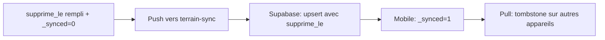
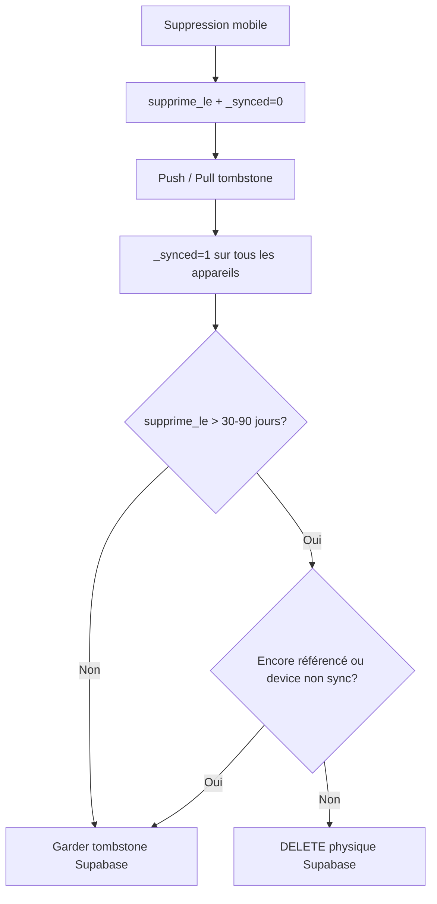
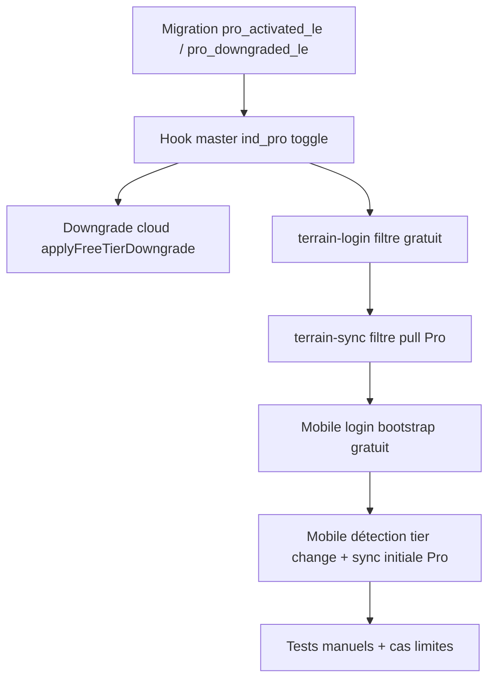

# Purpose of supprime_le
_Exported on 6/9/2026 at 08:04:14 GMT from Cursor (3.7.19)_

---

**User**

C est quoi le purpose de supprime_le

---

**Cursor**

Je cherche `supprime_le` dans le projet pour en expliquer le rôle.


`supprime_le` sert à la **suppression logique** (pattern **tombstone**) pour la sync entre l’app terrain (SQLite) et Supabase.

## Rôle principal

Au lieu de faire un `DELETE` SQL, on **marque** l’enregistrement comme supprimé en remplissant `supprime_le` avec la date/heure ISO de suppression.

La migration le dit explicitement :

```1:5:supabase/migrations/20260603120000_supprime_le_sync.sql
-- Tombstones pour sync bidirectionnelle (suppression logique)
ALTER TABLE clients ADD COLUMN IF NOT EXISTS supprime_le TIMESTAMPTZ;
ALTER TABLE chantiers ADD COLUMN IF NOT EXISTS supprime_le TIMESTAMPTZ;
ALTER TABLE releves ADD COLUMN IF NOT EXISTS supprime_le TIMESTAMPTZ;
ALTER TABLE ligne_releves ADD COLUMN IF NOT EXISTS supprime_le TIMESTAMPTZ;
```

## Pourquoi c’est nécessaire

En mode offline-first, un vrai `DELETE` local ne se propage pas bien : l’autre côté ne sait pas qu’il faut supprimer la ligne. Avec `supprime_le` :

1. **La ligne reste en base** → la sync peut la pousser/tirer.
2. **L’UI et les requêtes** filtrent avec `supprime_le IS NULL` → l’utilisateur ne voit plus l’élément.
3. **Les autres appareils** reçoivent le tombstone et appliquent la même suppression logique.

Exemple de suppression locale d’un client (cascade sur chantiers, relevés, lignes) :

```1332:1374:src/db/querries.js
export const deleteClientLocal = async (clientId) => {
  // ...
  await db.runAsync(
    `UPDATE ligne_releves SET supprime_le = ?, _synced = 0, ... WHERE ...`
  );
  // ... releves, chantiers, clients
  await db.runAsync(
    `UPDATE clients SET supprime_le = ?, _synced = 0, ... WHERE id = ?;`
  );
};
```

`_synced = 0` indique que la suppression doit encore être synchronisée.

## Conflits de sync

Dans `terrainSyncMerge.js`, si le mobile a supprimé localement (`supprime_le` rempli, pas encore sync) mais le serveur renvoie encore la ligne vivante, **on garde la suppression locale** :

```17:20:src/db/terrainSyncMerge.js
  const localPendingDelete = Boolean(localRow.supprime_le) && Number(localRow._synced) === 0;
  if (localPendingDelete && !remoteRow.supprime_le) {
    return false;
  }
```

## Tables concernées

- `clients`
- `chantiers`
- `releves`
- `ligne_releves`

En résumé : **`supprime_le` = “supprimé le …”** — ce n’est pas un champ métier visible par l’utilisateur, c’est le mécanisme qui permet de **supprimer proprement entre app et cloud** sans perdre l’info de suppression pendant la sync.

---

**User**

30. Puisque Ouvrage peut etre modifier depuis mobile, ajoute supprime_le a ouvrage et ouvrage_unite

---

**Cursor**

J’ajoute `supprime_le` aux tables `ouvrages` et `ouvrage_unites` en suivant le même modèle que les autres entités synchronisées.


J’implémente `supprime_le` sur `ouvrages` et `ouvrage_unites`, en remplaçant la suppression physique et `pending_cloud_deletes` par des tombstones synchronisables.


Je restaure la compatibilité avec les anciennes suppressions en attente et je corrige la requête de suppression locale.


`supprime_le` est maintenant en place sur `ouvrages` et `ouvrage_unites`, sur le même modèle que clients/relevés.

### Schéma
- Migration Supabase : `supabase/migrations/20260607120000_supprime_le_ouvrages.sql`
- Colonnes ajoutées dans `schema.sql`, SQLite (`localDb.js`) et migrations automatiques au démarrage

### Sync
- `terrainSync.js` et `terrain-sync/index.ts` : colonne incluse dans le push/pull
- `terrainSyncMerge.js` : `ouvrages` / `ouvrage_unites` passent en tables transactionnelles avec résolution de conflits (`shouldApplyRemoteRow`)
- Suppression côté serveur : tombstone au lieu de `DELETE` (y compris pour l’ancien payload `delete.ouvrages`)
- `master-admin-crud` : soft delete admin avec cascade sur `ouvrage_unites`

### App mobile
- `deleteOuvrageLocal` : marque `supprime_le` sur l’ouvrage et ses unités (`_synced = 0`) au lieu de supprimer physiquement
- Requêtes liste/comptage filtrées avec `supprime_le IS NULL`
- Migration des anciennes entrées `pending_cloud_deletes` vers tombstones si la ligne locale existe encore

### Admin web
- Champ `supprime_le` ajouté aux formulaires ouvrages / ouvrage_unites

**À faire de ton côté** : appliquer la migration Supabase (`supabase db push` ou déploiement des migrations).

---

**User**

Erreur enregistrement client/chantier: Error: Network request failed. Although it's been saved

---

**Cursor**

Je cherche l’origine du message « Network request failed » lors de l’enregistrement client/chantier.


Le client/chantier est bien enregistré localement ; l’erreur vient probablement de l’upload cloud des photos (Pro, hors ligne). Je corrige pour ne sauver qu’en local et reporter l’upload à la sync.


**Cause :** l’enregistrement SQLite réussissait, puis une étape réseau échouait **après** — surtout l’**upload immédiat des photos** vers Supabase Storage pour les comptes Pro (ou photos de lignes de relevé). Hors ligne ou réseau instable → `Network request failed`, alors que client/chantier/relevé étaient déjà sauvés.

**Corrections :**

1. **`terrainImageStorage.js`** — `persistTerrainImage` ne tente plus l’upload cloud à la sauvegarde. L’image reste en local ; l’envoi se fait plus tard via `syncPendingTerrainImagesToCloud` (comme le reste des données `_synced = 0`).

2. **`ClientChantierFormScreen.js`** — `buildChantierPhotoUris` n’envoie plus 3 « suppressions » vides sur un chantier neuf (évitait 3 appels inutiles à `clearChantierPhotoLocal`).

Après rebuild, l’enregistrement client/chantier doit se terminer sans alerte d’erreur, même sans réseau. La sync cloud (données + images) se fera à la prochaine sync Pro automatique ou manuelle depuis l’écran Plus.

---

**User**

Corrige Chantier card. Relevé au lieu de dimension badge

---

**Cursor**

Le badge du statut `D` affichait « Dimension » via `CHANTIER_STATUS_LABELS` dans `chantierStatus.js`. La carte chantier (`ListeChantiers`) passe par `getChantierStatusLabel`, donc la correction est centralisée là.

**Changement :** `D: 'Dimension'` → `D: 'Relevé'`

Les cartes chantier avec statut `D` affichent maintenant **Relevé**, comme dans les rapports. Les autres statuts (Devis, En cours, Terminé, Annulé) sont inchangés.

---

**User**

Que se passe t il apres que supprime_le > 0

---

**Cursor**

Je vérifie dans le code le comportement exact une fois `supprime_le` renseigné.


`supprime_le` n’est **pas un nombre** : c’est une **date/heure ISO** (timestamp). Quand elle est **remplie** (`NOT NULL`), l’enregistrement est considéré comme **supprimé logiquement** (tombstone). Voici ce qui se passe ensuite.

## 1. Au moment de la suppression (mobile)

Pas de `DELETE` SQL. On fait un `UPDATE` :

```1412:1418:src/db/querries.js
    await db.runAsync(
      `
      UPDATE clients
      SET supprime_le = ?, _synced = 0, mis_a_jour_le = datetime('now')
      WHERE id = ?;
      `,
      [deletedAt, clientId]
```

En cascade selon l’entité :
- **Client** → chantiers, relevés, lignes marqués aussi
- **Chantier** → relevés + lignes
- **Relevé** → lignes
- **Ouvrage** → ouvrage + `ouvrage_unites` (si pas utilisé dans un relevé)

`_synced = 0` signifie : **la suppression doit encore être poussée vers Supabase**.

## 2. Côté app (UI)

La ligne **reste en base**, mais disparaît des écrans :

- listes clients / chantiers / ouvrages
- comptages (limites compte gratuit)
- recherches actives

Toutes ces requêtes filtrent avec :

```sql
AND supprime_le IS NULL
```

L’utilisateur ne voit plus l’élément, mais l’historique peut rester visible là où on ne filtre pas (ex. lignes de relevé déjà saisies qui référencent un ancien `ouvrage_unite_id`).

## 3. Synchronisation cloud (compte Pro)



1. **Push** : la ligne supprimée part quand même (avec `supprime_le` rempli).
2. **Supabase** : la ligne reste en base, marquée supprimée (plus de `DELETE` dur pour ouvrages ; idem pour clients/chantiers/relevés).
3. **Après push réussi** : `_synced = 1` localement.
4. **Pull** : les autres appareils reçoivent le tombstone et appliquent la même suppression logique.

### Conflit offline

Si le mobile a supprimé localement mais le serveur renvoie encore la version « vivante », **on garde la suppression locale** tant que `_synced = 0` :

```17:20:src/db/terrainSyncMerge.js
  const localPendingDelete = Boolean(localRow.supprime_le) && Number(localRow._synced) === 0;
  if (localPendingDelete && !remoteRow.supprime_le) {
    return false;
  }
```

## 4. Admin web

`master-admin-crud` ne charge que les enregistrements actifs :

```122:124:supabase/functions/master-admin-crud/index.ts
        if (SOFT_DELETE_TABLES.has(tableKey)) {
          query = query.is('supprime_le', null);
        }
```

Une suppression admin fait la même chose : `UPDATE supprime_le = now` (avec cascade selon la table).

## 5. Ce qui ne se passe pas

- **Pas de purge automatique** : aucun code ne fait un vrai `DELETE` après coup (sauf ancien chemin ouvrage si la colonne `supprime_le` n’existe pas encore sur un très vieux SQLite).
- **Pas de restauration** dans l’app : pas de bouton « annuler suppression » ; il faudrait remettre `supprime_le = NULL` manuellement (admin / SQL).
- **Pas d’impact sur métiers/unités** : seules les tables métier entreprise utilisent `supprime_le`.

## En résumé

| Étape | Effet |
|--------|--------|
| `supprime_le` rempli | Suppression logique |
| Ligne en base | Conservée (tombstone) |
| UI | Masquée |
| `_synced = 0` | En attente de sync |
| Sync OK | Cloud + autres mobiles alignés |
| `_synced = 1` | Suppression confirmée partout |

En une phrase : **`supprime_le` = « supprimé le … »** — l’élément est mort pour l’app et la sync, mais la trace reste en base pour que tous les appareils et Supabase s’accordent sur la suppression.

---

**User**

Ne pense tu pas qu on devrait purger dans Supabase?

---

**Cursor**

Bonne question. **Oui, une purge Supabase peut se défendre**, mais **pas tout de suite** et **pas partout** avec votre modèle actuel offline-first.

## Pourquoi les tombstones existent aujourd’hui

`supprime_le` sert surtout à la **sync bidirectionnelle** :

- un téléphone supprime offline ;
- la ligne reste en base avec `supprime_le` + `_synced = 0` ;
- au push, Supabase reçoit la suppression ;
- au pull, les autres appareils appliquent le même tombstone.

Si vous **DELETE** trop tôt côté Supabase, un appareil qui n’a pas encore sync peut :

- **ressusciter** l’enregistrement au prochain push (sa copie locale sans `supprime_le`), ou
- ne **jamais apprendre** la suppression (le pull ne renvoie plus rien).

Tant que la sync n’est pas fiable à 100 % sur tous les appareils, les tombstones cloud sont une **assurance**, pas du gaspillage.

## Faut-il purger quand même ?

**Oui, mais en purge différée**, pas en remplacement immédiat du soft delete.

| Approche | Verdict |
|----------|---------|
| Soft delete seulement (actuel) | Correct pour la sync |
| DELETE immédiat après `supprime_le` | Risqué offline |
| Purge après délai + conditions | Bon compromis |
| Purge SQLite mobile | Encore plus risqué (historique local, offline) |

## Ce qu’on peut purger (et ce qu’il vaut mieux garder)

**Candidats à une purge Supabase** (après délai, ex. 30–90 jours, et `_synced = 1` partout) :

- clients / chantiers / relevés / lignes déjà tombstonés **sur tous les appareils actifs**
- ouvrages / `ouvrage_unites` tombstonés **sans usage** dans des lignes actives

**À ne pas purger à la légère** :

- `ouvrage_unites` référencées par `ligne_releves` → contrainte **`ON DELETE RESTRICT`** dans votre schéma : un vrai `DELETE` **échouera** tant qu’il existe des lignes de relevé, même supprimées logiquement.
- toute entité dont un mobile offline pourrait encore avoir une copie « vivante ».

En pratique : la purge cloud a surtout du sens pour **alléger la base** et la **conformité** (données vraiment effacées), pas pour le fonctionnement quotidien de l’app.

## Modèle recommandé



Concrètement :

1. **Garder** le soft delete comme mécanisme principal (ne change pas l’app).
2. **Ajouter** un job Supabase (cron / Edge Function planifiée) :
   - `WHERE supprime_le IS NOT NULL AND supprime_le < now() - interval '90 days'`
   - + vérifier qu’aucune FK active ne bloque (surtout `ouvrage_unites`).
3. **Ne pas purger SQLite** automatiquement côté mobile (ou seulement des tombstones très anciennes `_synced = 1`, optionnel).
4. **Optionnel** : table `sync_ack` ou horodatage « dernière sync entreprise » pour ne purger que quand tous les profils ont pull récemment.

## Mon avis pour Losange

- **Court terme** : ne pas purger — votre priorité est la **cohérence multi-appareils**.
- **Moyen terme** : purge Supabase **différée** (90 jours), **uniquement** sur les lignes tombstonées sans dépendances.
- **Long terme** : si le volume devient gros, envisager une table `deletions(id, table, supprime_le)` dédiée à la sync, puis purge des données métier — plus propre, mais refactor plus lourd.

En résumé : **oui, purger dans Supabase peut être souhaitable** (taille, RGPD, admin plus propre), mais **en complément** du tombstone, **après un délai de grâce**, pas en remplacement. Le soft delete reste le bon modèle pour l’app terrain ; la purge cloud serait de la **ménage backend**.

Si tu veux, on peut implémenter une migration + Edge Function `purge-tombstones` avec les règles exactes (délai, tables, garde-fous FK).

---

**User**

- JE ne comprends pas le modal de synchronisation. Simplifié les le content et concise.

---

**Cursor**

Je simplifie le message de l'alerte de synchronisation dans `PlusScreen.js`.


Le modal (alerte après le bouton sync dans **Plus**) affichait trop de détails techniques : compteurs push, Supabase, catalogue, modes push/pull…

**Avant** — exemple :
> Envoi : 2 client(s), 1 chantier(s)…  
> Puis mise à jour depuis Supabase si le cloud est plus récent.  
> Catalogue : 12 métier(s)…

**Maintenant** — deux cas seulement :

| Situation | Message |
|-----------|---------|
| Tout est sync | **Données à jour.** |
| Reste des modifs locales | **X modification(s) en attente. Réessayez avec internet.** |

Le titre reste « Synchronisation » ; le corps tient en une phrase.

---

**User**

Network request Failed lors de l upload des images

---

**Cursor**

Je trace le flux d’upload d’images pour trouver où « Network request failed » remonte encore.


Le problème vient probablement de `fetch()` sur une URI locale (`file://`), qui échoue souvent sur React Native. Je remplace ça par une lecture via `expo-file-system`.


**Cause :** sur mobile, `uploadImageToCloud` utilisait `fetch(file://...)` pour lire l’image locale. Sur React Native (surtout Android), ça provoque souvent **`Network request failed`**, même pour un fichier local.

**Corrections dans `terrainImageStorage.js` :**

1. **Lecture locale** via `FileSystem.readAsStringAsync` (base64) → conversion en `Uint8Array` pour Supabase Storage (plus de `fetch` sur `file://`).
2. **`try/catch`** autour de l’upload pour qu’une image en échec n’interrompe pas toute la sync.
3. **`syncPendingTerrainImagesToCloud`** : chaque image est isolée dans un `try/catch` — la sync des données continue même si une photo échoue.

Les photos restent **enregistrées localement** dès la prise ; l’envoi cloud se fait à la sync (bouton sync dans Plus). Reteste avec internet actif : l’upload devrait passer. Si une image échoue encore, ce sera un message Supabase explicite (droits storage, bucket, etc.), pas `Network request failed`.

---

**User**

Dans pavé, Qté en black, PU en black, MT en bleu. Affiche MT = xxx  

---

**Cursor**

Modifications dans `PaveSaisieOneHand.js` (ligne de résumé sous le pavé) :

| Champ | Avant | Après |
|-------|--------|--------|
| **Qté** | Bleu | Noir (`chantierColors.text`) |
| **PU** | Bleu | Noir |
| **MT** | Montant seul, noir | **`MT = xxx`**, bleu (`#1D4ED8`) |

Exemple affiché : `Qté = 12,00 m²` · `PU = 1 500 F` · **`MT = 18 000 F`** (en bleu).

---

**User**

Dans recapitulatif, montre le image Background sur la ligne qui a une photo (similaire a ecran details)

---

**Cursor**

Le récap utilise `variant="recap"` alors que l’icône photo n’apparaît que pour `variant="details"`. J’aligne les deux et je prends en compte `photo_pending_uri` des brouillons.


Modifications dans `LigneReleveCard.js` :

1. **Récap = détails** — l’icône photo en filigrane (centre, opacité réduite) s’affiche aussi pour `variant="recap"`, pas seulement `details`.
2. **Photos du brouillon** — prise en compte de `photo_pending_uri` en plus de `photo`, pour les lignes du récap avant enregistrement final.

Une ligne avec photo dans le récapitulatif a donc le même fond visuel (icône image) que sur l’écran détail chantier.

---

**User**

@access_rules.md (32-34) 

---

**Cursor**

Je lis les règles d'accès et le code actuel (Pro/gratuit, sync, master) pour proposer un plan d'implémentation.


Voici un **plan d’implémentation** pour les règles §3 de `access_rules.md`, aligné sur l’existant du projet.

---

## Contexte actuel (écarts)

| Comportement | Aujourd’hui |
|--------------|-------------|
| Compte gratuit | Sync limitée à `entreprises` (+ profil via pull account-only) — OK côté `terrain-sync` |
| Login terrain | `terrain-login` renvoie **toutes** les données cloud ; `syncTerrainBootstrapLocal` les charge en local **même si gratuit** |
| Passage Pro | Toggle `ind_pro` dans Admin master → aucun hook dédié |
| Passage Gratuit | Aucune purge cloud automatique ; données Pro restent visibles au prochain login |

---

## Principe retenu

Centraliser le changement de tier dans **l’écran master** (`master-admin-crud`, table `entreprises`, champ `ind_pro`) et propager via :

1. une **Edge Function dédiée** (recommandé) ou une branche dans `master-admin-crud` ;
2. un **marqueur temporel** sur l’entreprise ;
3. une **réaction mobile** au prochain login / sync / vérif session.

---

## Phase 0 — Décisions à valider (questions ouvertes)

Avant de coder, trancher :

1. **Gratuit → Pro** : au premier sync Pro, faut-il **télécharger** d’éventuelles données cloud déjà présentes (ex. ancienne période Pro), ou **pousser uniquement le local** créé pendant la période gratuite ?
   - Proposition : **push local d’abord**, pull transactionnel **seulement** si `mis_a_jour_le >= pro_activated_le` (pas de « resurrection » d’anciennes données tombstonées).

2. **Pro → Gratuit** : que faire des **profils > 1** ?
   - Proposition : garder le profil **Admin (A)** ; les autres profils → `supprime_le` (ou désactivation sans identifiant).

3. **Pro → Gratuit** : si l’entreprise a **> 10 clients / chantiers**, on tombstone **tout** ou on **garde les 10 plus récents** ?
   - Proposition : garder les **10 clients + 10 chantiers les plus récents** (par `mis_a_jour_le`), tombstone le reste en cascade.

4. **Pro → Gratuit** : ouvrages (> 10/métier) — même logique de trim ou tombstone total ?
   - Proposition : **10 ouvrages actifs max par métier** (plus récents), reste tombstoné.

5. **Photos / logo** : suppression storage Supabase en plus du tombstone SQL ?
   - Proposition : **oui** pour logo + photos chantier/ligne (bucket `terrain-files`), en best-effort.

---

## Phase 1 — Schéma Supabase

Migration `entreprises` :

```sql
pro_activated_le TIMESTAMPTZ   -- rempli quand ind_pro passe 0 → 1
pro_downgraded_le TIMESTAMPTZ  -- rempli quand ind_pro passe 1 → 0
```

Même colonnes en SQLite local (migration `localDb.js`).

---

## Phase 2 — Gratuit → Pro (master + sync)

### 2.1 Hook master (`master-admin-crud` ou `entreprise-tier-change`)

Quand `ind_pro` passe **0 → 1** sur une entreprise :

- `pro_activated_le = now()`
- `pro_downgraded_le = NULL`
- `_synced = 1`, `mis_a_jour_le = now()`
- **Ne pas** toucher aux données transactionnelles existantes sur le cloud

### 2.2 `terrain-sync` (serveur)

- Si `ind_pro = 1` :
  - **Push** : accepter ouvrages, clients, chantiers, relevés, lignes, images (inchangé).
  - **Pull transactionnel** : filtrer les lignes actives avec  
    `supprime_le IS NULL AND mis_a_jour_le >= pro_activated_le`  
    (ou `cree_le >= pro_activated_le` si préféré).
  - Catalogue métiers/unités : pull complet (comme aujourd’hui).

→ La sync « métier » ne remonte que ce qui est **post-activation Pro** + ce que le mobile pousse.

### 2.3 Mobile

| Fichier | Changement |
|---------|------------|
| `terrainAuth.js` | Si `ind_pro = 0` au login : bootstrap **sans** clients/chantiers/relevés/lignes cloud (ou les ignorer). |
| `terrainSyncPro.js` | Au passage détecté gratuit→Pro (comparaison `ind_pro` local vs pull) : marquer `_synced = 0` sur toutes les lignes locales transactionnelles → **premier push Pro** envoie l’historique local gratuit. |
| `terrainSyncScheduler` | Inchangé (sync auto seulement si Pro). |

### 2.4 UX

- Message master (optionnel) : « Compte passé en Pro — la sync cloud démarre à partir de maintenant. »
- Mobile au prochain login/sync : toast discret « Sync cloud activée ».

---

## Phase 3 — Pro → Gratuit (purge cloud + privilèges)

### 3.1 Hook master (même point d’entrée)

Quand `ind_pro` passe **1 → 0** :

Appeler une routine serveur **`applyFreeTierDowngrade(entrepriseId)`** :

```
1. pro_downgraded_le = now()
2. entreprises : logo = NULL, ind_tva = 0
3. Tombstone cascade (supprime_le = now) :
   - ouvrage_unites → ouvrages (entreprise)
   - ligne_releves → releves → chantiers → clients
4. Trim aux limites gratuites (si > plafond) :
   - clients : garder 10 plus récents, tombstone le reste (+ cascade)
   - chantiers : idem
   - ouvrages : 10/métier max
   - profils : garder 1 (Admin prioritaire)
5. Purge storage (logo, photo_1/2/3, photos lignes)
6. _synced = 1 partout côté cloud
```

Réutiliser la logique cascade déjà présente dans `master-admin-crud` (delete client) et `deleteOuvrageLocal`.

### 3.2 `terrain-sync`

- Si `ind_pro = 0` : refuser push transactionnel (déjà le cas).
- Pull : **account-only** (`entreprise`, `profils` limités).

### 3.3 `terrain-login`

- Si `ind_pro = 0` : ne renvoyer que `entreprise`, `profil(s)` autorisés, `metiers`, `unites` — **pas** clients/chantiers/relevés/lignes/ouvrages entreprise.

### 3.4 Mobile (après downgrade)

Au prochain `ensureTerrainSessionAllowed` / login :

1. Détecter `ind_pro` passé de 1 → 0.
2. Appliquer tombstones locaux (mirror cloud) **ou** `applyFreeTierLocal(entrepriseId)` :
   - tombstone données transactionnelles excédentaires ;
   - clear logo local ;
   - reset `ind_tva` local ;
   - désactiver sync auto, WhatsApp, rapports, OK ligne, etc. (déjà gouverné par `isProAccount`).

---

## Phase 4 — Fichiers à toucher (résumé)

| Zone | Fichiers |
|------|----------|
| SQL | migration Supabase, `schema.sql`, `localDb.js` |
| Edge | `master-admin-crud/index.ts`, nouveau `entreprise-tier-change/index.ts` (optionnel), `terrain-sync/index.ts`, `terrain-login/index.ts` |
| Mobile | `terrainAuth.js`, `terrainSyncPro.js`, `terrainSyncMerge.js`, `querries.js` (helper downgrade local), `freeTierLimits.js` |
| Admin web | `AdminScreen.js` — confirmation modal avant toggle `ind_pro` |
| Docs | `access_rules.md`, `supabase/functions/README.md` |

---

## Phase 5 — Ordre d’implémentation suggéré



1. Migration + hook master (sans mobile) — testable via Supabase SQL.
2. Downgrade cloud — vérifier tombstones + limites 10/10/3/10.
3. Filtrage `terrain-login` / `terrain-sync`.
4. Adaptation mobile login + première sync Pro.
5. Modal confirmation master + tests bout en bout.

---

## Phase 6 — Scénarios de test

| # | Scénario | Résultat attendu |
|---|----------|------------------|
| 1 | Gratuit, 5 chantiers locaux, master → Pro, sync | 5 chantiers poussés cloud ; pas de pull d’anciennes données tombstonées |
| 2 | Pro, 20 clients cloud, master → Gratuit | 10 clients actifs max ; 10 tombstonés ; logo/TVA off |
| 3 | Pro → Gratuit → login mobile | UI gratuite ; pas de sync transactionnelle ; données locales alignées |
| 4 | Gratuit → Pro → Gratuit rapide | Pas de données transactionnelles orphelines cloud |
| 5 | Pro avec photos | Downgrade supprime fichiers storage + clés en base |

---

## Effort estimé

| Bloc | Complexité |
|------|------------|
| Migration + hook master | Faible |
| Downgrade cloud (cascade + trim + storage) | **Élevée** |
| Filtres login/sync | Moyenne |
| Mobile tier detection | Moyenne |
| Tests | Moyenne |

---

Valide surtout les **5 questions de la phase 0** (pull post-upgrade, gestion profils, règle de trim 10/10, ouvrages, purge storage). Une fois confirmé, on peut enchaîner l’implémentation dans cet ordre.

---

**User**

Sauvegarde le plan dans /prompts/upgrade_downgrade.md et implemente le. Je valide les 5 points en utilisant tes recommendations

---

**Cursor**

Je sauvegarde le plan validé, puis j’implémente le changement de tier Gratuit ↔ Pro.


Je reprends l'implémentation : plan, migration, logique serveur et mobile.


Implémentation terminée selon le plan validé dans `prompts/upgrade_downgrade.md`.

## Plan sauvegardé

Le document décrit les 5 décisions validées, l’architecture et les scénarios de test.

## Ce qui a été implémenté

### Schéma
- Migration `supabase/migrations/20260607130000_entreprise_tier_markers.sql`
- Colonnes `pro_activated_le` / `pro_downgraded_le` sur Supabase, SQLite (`localDb.js`) et sync mobile (`terrainSync.js`)

### Serveur
- **`supabase/functions/_shared/entrepriseTier.ts`** — logique partagée :
  - `applyFreeTierDowngrade` (trim 10/10/10, profil Admin seul, purge storage)
  - `applyProUpgradeFields`, filtre pull Pro par `pro_activated_le`
- **`master-admin-crud`** — hook sur toggle `ind_pro` (upgrade/downgrade)
- **`terrain-login`** — gratuit : compte + catalogue uniquement ; Pro : pull filtré post-activation
- **`terrain-sync`** — gratuit : sync account-only ; Pro : pull transactionnel filtré

### Mobile
- **`src/db/entrepriseTierLocal.js`** — miroir local du downgrade + détection upgrade (marque `_synced = 0`)
- **`terrainAuth.js`** — bootstrap adapté au tier, réconciliation au login / vérif session
- **`terrainSyncPro.js`** — réconciliation avant chaque pull

### Admin web
- Confirmation avant changement de `ind_pro`
- Champs lecture seule `pro_activated_le` / `pro_downgraded_le`

## Déploiement requis

1. Appliquer la migration SQL sur Supabase
2. Redéployer les Edge Functions (incluant `_shared`) :

```bash
supabase functions deploy master-admin-crud
supabase functions deploy terrain-login
supabase functions deploy terrain-sync
```

## Tests manuels suggérés

| Scénario | Attendu |
|----------|---------|
| Gratuit → Pro (master) + sync mobile | Données locales poussées, pas de resurrection d’anciennes tombstones |
| Pro → Gratuit avec 20 clients | 10 clients actifs max, logo/TVA off, photos purgées |
| Login mobile après downgrade | UI gratuite, données locales alignées |

Souhaitez-vous que je crée un commit git pour ces changements ?

---

**User**

Failed to deploy edge function: Failed to bundle the function (reason: Module not found "file:///tmp/user_fn_cbjkuecorfuxythadckj_65e37b9f-caf8-4632-9259-3638763f2c75_3/_shared/entrepriseTier.ts". at file:///tmp/user_fn_cbjkuecorfuxythadckj_65e37b9f-caf8-4632-9259-3638763f2c75_3/source/index.ts:6:8).

---

**Cursor**

Le déploiement Supabase n'inclut pas `_shared` au bundle — je déplace la logique partagée dans chaque fonction concernée.


Le bundler Supabase n'inclut pas `../_shared/` — je copie le module dans chaque dossier de fonction et mets à jour les imports.


Le bundler Supabase ne copie pas le dossier `../_shared/` lors du déploiement — d’où l’erreur `Module not found`.

**Correction :** le code est maintenant dans chaque dossier de fonction, avec des imports locaux :

| Fonction | Fichiers |
|----------|----------|
| `master-admin-crud` | `index.ts` + `entrepriseTier.ts` (logique complète downgrade/upgrade) |
| `terrain-login` | `index.ts` + `entrepriseTier.ts` (filtre pull Pro) |
| `terrain-sync` | `index.ts` + `entrepriseTier.ts` (filtre pull Pro) |

Redéployez via CLI depuis la racine du projet :

```bash
supabase functions deploy master-admin-crud
supabase functions deploy terrain-login
supabase functions deploy terrain-sync
```

Si vous déployez via le **Dashboard**, il faut ajouter `entrepriseTier.ts` dans le même dossier que `index.ts` pour chaque fonction concernée (ou rester sur la CLI, plus simple).

Le README dans `supabase/functions/` a été mis à jour avec cette contrainte.

---

**User**

Was ecran master updated to include the pro_activated_le and pro_downgraded_le?

---

**Cursor**

Oui. L’écran master (`AdminScreen.js`) inclut bien ces deux champs sur la table **Entreprises** :

- **Labels** : `Pro activé le` / `Pro désactivé le` (dans `FIELD_LABELS`)
- **Schéma** : champs en lecture seule, section **Compte** :

```92:93:src/screens/web/AdminScreen.js
    { name: 'pro_activated_le', type: 'TEXT', isReadOnly: true, section: 'Compte' },
    { name: 'pro_downgraded_le', type: 'TEXT', isReadOnly: true, section: 'Compte' },
```

Ils sont remplis automatiquement côté serveur quand vous basculez `ind_pro` dans `master-admin-crud` (pas éditables à la main). Une modal de confirmation s’affiche aussi avant un changement Gratuit ↔ Pro.

Note : le petit texte d’aide sous les champs read-only dit encore « par l’application mobile » — ce n’est pas exact pour ces deux-là (c’est le hook master). Je peux le corriger si vous voulez.

---

**User**

@prompts_3.md (124-125) 

---

**Cursor**

Je vérifie l’affichage des champs dans l’écran master et le hook de changement Pro côté `master-admin-crud`.


Deux causes probables : colonnes absentes en base et/ou champs tier écrasés à `null` à la sauvegarde. Je corrige l’écran master et le hook serveur.


Oui, les champs étaient dans le code, mais deux problèmes expliquent ce que vous voyez :

## 1. Affichage dans l’écran master

Les champs étaient en bas du formulaire, sans section dans la vue **Détails**, et affichaient `-` quand vides — facile à manquer.

**Corrigé :**
- `Pro activé le` / `Pro désactivé le` placés juste sous **Compte Pro**, section **Compte**
- Sections visibles aussi en mode Détails
- Valeur vide affichée comme `— (non renseigné)` au lieu de `-`
- Alerte après un changement Gratuit ↔ Pro confirmé

## 2. Rien en base Supabase au passage Gratuit → Pro

Causes probables :

| Cause | Effet |
|-------|--------|
| **Migration SQL non appliquée** | colonnes `pro_activated_le` / `pro_downgraded_le` absentes |
| **`master-admin-crud` non redéployé** | pas de hook upgrade (seul `ind_pro` change) |
| **Bug client** | l’écran renvoyait `pro_activated_le: null` à chaque save |

**Corrigé côté code :**
- Le client **n’envoie plus** ces champs (gérés uniquement par le serveur)
- Le serveur **ignore** les valeurs client et remplit les marqueurs au changement de tier

## À faire de votre côté

**1. Migration Supabase** (éditeur SQL) :

```sql
ALTER TABLE entreprises ADD COLUMN IF NOT EXISTS pro_activated_le TIMESTAMPTZ;
ALTER TABLE entreprises ADD COLUMN IF NOT EXISTS pro_downgraded_le TIMESTAMPTZ;
```

**2. Redéployer la fonction :**

```bash
supabase functions deploy master-admin-crud
```

**3. Recharger l’app master** (hard refresh), repasser Gratuit → Pro : vous devriez voir une alerte + `pro_activated_le` rempli dans Détails.

Si après migration + deploy ça ne marche toujours pas, vérifiez dans Supabase que `ind_pro` passe bien de `0` à `1` (le hook ne se déclenche que sur ce changement, pas si le compte était déjà Pro).

---

**User**

Ne required pas le logo pour generer le devis ou PDF. Si logo n est pas disponible, utilise le logo the l application. J obtient error presentement lorsque j essaie d obtenir devis ou PDF pour une entreprise qui n a pas charge de logo.

---

**Cursor**

Je cherche où le devis/PDF exige le logo et comment basculer sur le logo de l’application si absent.


Renforçant le fallback vers le logo Losange et empêchant toute erreur si le logo entreprise est absent.


Corrigé dans `src/utils/exportLogo.js`.

## Problème

`resolveExportLogoDataUri` pouvait **échouer** dans ces cas :
- Compte **gratuit** → retour `null` sans fallback (pas d’erreur, mais pas de logo)
- Compte **Pro sans logo** → appel à `getAppLogoDataUri()` qui **lançait une exception** si l’asset ne se chargeait pas
- Logo en base (`entreprises.logo`) mais **fichier absent** localement → fallback fragile

## Correction

1. **Logo entreprise jamais obligatoire** — l’export continue même si aucun logo n’est résolu
2. **Fallback systématique** vers `assets/logo2.png` (logo Losange) si le logo entreprise est absent ou illisible
3. **Chargement du logo app renforcé** — plusieurs sources (`Asset`, `Image.resolveAssetSource`, `fetch` en secours)
4. **Plus d’exception** — en dernier recours, export sans logo plutôt qu’une erreur

Comportement :
- Logo entreprise chargé → logo entreprise dans le devis/PDF  
- Sinon → logo Losange  
- Si même le logo app échoue → document généré sans logo (pas d’erreur)

Vous pouvez retester devis et PDF sur une entreprise sans logo uploadé.

---

**User**

Lorsque ind_dimension = 1, P.U applique est calcule comme formule x 1 (lxhx1). Cependant, on peut changer P.U applique. ceci est different de P.U

---

**Cursor**

Je trace comment `P.U`, `P.U appliqué` et `ind_dimension` sont calculés et modifiés dans le code.


Corrigeant l’affichage : le P.U appliqué est confondu avec le montant (formule × prix) sur les lignes `ind_dimension = 1`. On sépare P.U catalogue, P.U appliqué (modifiable) et montant.


Corrigé. Voici la logique métier clarifiée et ce qui a changé :

## Modèle (ind_dimension = 1)

| Concept | Rôle |
|--------|------|
| **Quantité calculée** | `formule × n` (ex. l×h×n en m²) — stockée dans `quantite` |
| **Qté affichée** | `n` (nombre) |
| **P.U catalogue** | Prix de l’ouvrage_unité (référence) |
| **P.U appliqué** | Prix unitaire saisi/modifiable (défaut = catalogue) |
| **Montant** | `quantite × P.U appliqué` |

Le P.U appliqué n’est **pas** l×h×1 : c’est un prix au m² (ou autre unité), indépendant des dimensions.

## Corrections

1. **Détails / récap** — affichent le **P.U appliqué** réel (plus le montant masqué derrière « P.U. »).
2. **Devis** — colonne P.U. continue d’afficher le **montant** pour `ind_dimension = 1` (règle métier existante), sans modifier les valeurs stockées.
3. **Pavé numérique** — le P.U appliqué modifié manuellement n’est plus écrasé quand les dimensions changent ; libellés clarifiés (`P.U.` vs `MT`).

Exemple : l=200 cm, h=100 cm, n=2, P.U appliqué=5000 FCFA/m²  
→ quantité = 2×(2×1) = 4 m², montant = 20 000 FCFA, P.U affiché = 5000 FCFA.

---

**User**

@prompts_3.md (133-139) 

---

**Cursor**

Je corrige le calcul du P.U appliqué et du montant selon vos règles.


Corrigé selon vos règles.

## Règles appliquées

### P.U appliqué par défaut (pavé)
| `ind_dimension` | Calcul par défaut |
|-----------------|-------------------|
| **0** | P.U appliqué = P.U catalogue |
| **1** | P.U appliqué = P.U × formule(l,h,p) en mètres (ex. l×h pour « lxh ») |

Modifiable manuellement via le bouton Prix ; la valeur manuelle est conservée jusqu’au changement d’ouvrage.

### Montant
**Montant = P.U appliqué × n** (partout : pavé, enregistrement, devis)

`quantite` reste stockée séparément (formule × n) pour référence interne.

### Affichage
- **Pavé, récap, détails** : P.U = P.U appliqué
- **Devis** : colonne P.U = P.U appliqué, colonne Montant = P.U appliqué × n

## Exemple
P.U catalogue = 5 000 FCFA/m², l = 200 cm, h = 100 cm, n = 2  
→ P.U appliqué = 5 000 × 2 × 1 = **10 000**  
→ Montant = 10 000 × 2 = **20 000 FCFA**  
→ Qté affichée = **2** (n)

Fichiers touchés : `ligneReleveCalcul.js`, `PaveSaisieOneHand.js`, `formatLigneMesures.js`, `devisGrouping.js`, `querries.js`, `NouvelleDimensionScreen.js`, `AdminScreen.js`.

---

**User**

@prompts_3.md (141-142) 

---

**Cursor**

Mise à jour des noms de fichiers export et du partage WhatsApp pour utiliser le client.


§35 est implémenté. Les exports utilisent maintenant le **nom du client** et la **date** :

| Export | Nom du fichier |
|--------|----------------|
| Devis (téléchargement + WhatsApp) | `devis_{client}_{date}.pdf` |
| Relevés PDF (téléchargement + WhatsApp) | `releves_{client}_{date}.pdf` |

**Changements :**

- `src/utils/devisExport.js` — le slug est basé sur `chantier.client_nom` (au lieu du nom du chantier) ; `releve_` → `releves_` ; pour WhatsApp, le PDF est copié dans le cache avec le bon nom avant partage.
- `src/screens/ChantierDetails.js` — le partage WhatsApp passe `chantier` et le mode (`devis` / `pdf`).

Exemple : client « Dupont Martin », date du jour → `devis_Dupont_Martin_2026-06-07.pdf` ou `releves_Dupont_Martin_2026-06-07.pdf`.

---

**User**

Dans Rapports, ajoute footer "Annulé" exclu

---

**Cursor**

Ajout d’un pied de page indiquant que les chantiers « Annulé » sont exclus — déjà le cas dans les agrégations.


Un pied de page a été ajouté en bas de l’écran Rapports :

**« Annulé » exclu**

Cela rappelle que les chantiers au statut Annulé ne sont pas comptés dans les graphiques (déjà le cas dans `chantierReportStats.js`). Le texte est centré, en italique et dans la couleur secondaire, comme les autres mentions d’aide de l’écran.

---

**User**

4. Compte pro, Rapport disabled pour user C et T

---

**Cursor**

Les rôles C et T sont encore autorisés pour Rapports — je restreins l'accès à l'admin (A) uniquement.


Règle §4 appliquée dans `src/utils/terrainAccess.js`.

**Accès Rapports (compte Pro) :**
| Rôle | Rapports |
|------|----------|
| A (Admin) | Oui |
| C (Commercial) | Non |
| T (Terrain) | Non |
| S | Non (inchangé) |

Le bouton **Rapports** dans le menu Plus est masqué pour C et T via `canAccessRapports`, qui n’autorise plus que le rôle **A** sur un compte Pro. Les comptes Gratuit restent exclus comme avant (`is_pro` requis).

---

**User**

@access_rules.md (40-41) 

---

**Cursor**

Mise en place des restrictions d'accès : Métiers/Ouvrages réservés à l'admin ; détails, modification et suppression des clients désactivés pour les autres rôles.


Règles §40–41 appliquées.

### Base de données → Métiers & Ouvrages (admin A uniquement)
- `DatabaseScreen` : les boutons **Métiers** et **Ouvrages** sont masqués pour C, T, S.
- `App.js` : redirection vers **Base de données** si un non-admin accède à ces écrans.

### Base de données → Clients (admin A uniquement)
| Action | Non-admin |
|--------|-----------|
| Liste clients | Visible (lecture) |
| Ouvrir détail client | Désactivé |
| Modifier (barre du bas) | Désactivé |
| Supprimer (FAB) | Masqué |

### Fichiers modifiés
- `src/utils/terrainAccess.js` — `canAccessDatabaseMetiersOuvrages`, `canManageClients`
- `src/screens/DatabaseScreen.js`
- `src/screens/ListeClientsScreen.js`
- `src/screens/ClientDetailsScreen.js`
- `App.js` — garde navigation + bouton **Modifier** conditionnel

---

**User**

@access_rules.md (46-48) 

---

**Cursor**

Règles §6 appliquées.

### 1. C et T peuvent créer un ouvrage (nouveau / modifier relevé)
Dans `NouvelleDimensionScreen`, le bouton **+** sur l’étape ouvrage est accessible aux rôles **A**, **C** et **T** (plus seulement A).

- Nouveau helper : `canCreateOuvrageInReleveFlow` dans `terrainAccess.js`
- Le rôle **S** reste sans accès à la création depuis ce flux

### 2. Nom en doublon → bouton Créer désactivé
Dans `AjouterOuvrageModal` :
- Comparaison **insensible à la casse** avec les ouvrages du métier courant
- Bouton **Créer** désactivé si le nom existe déjà
- Message : *« Un ouvrage avec ce nom existe déjà pour ce métier. »*

**Fichiers modifiés :**
- `src/utils/terrainAccess.js`
- `src/screens/NouvelleDimensionScreen.js`
- `src/components/terrain/AjouterOuvrageModal.js`

---

**User**

C et T ne peuvent pas modifier P.U appliqué. Lorsque C ou T crée nouvel ouvrage, par defaut, P.U = 1.


@access_rules.md (50-51) 

---

**Cursor**

Mise en œuvre : P.U catalogue = 1 par défaut pour C/T à la création d'ouvrage, et blocage de la modification du P.U appliqué dans le pavé.


Règles §50–51 appliquées.

### Création d’ouvrage (C et T) → P.U catalogue = 1
Dans `AjouterOuvrageModal`, pour les rôles C et T :
- Le prix unitaire est fixé à **1 F** (non modifiable)
- Le champ saisie est remplacé par un affichage en lecture seule
- L’enregistrement utilise toujours `prixUnitaire: 1`

### Pavé numérique → P.U appliqué non modifiable (C et T)
Dans `PaveSaisieOneHand` :
- Nouveau helper `canEditPrixUnitaireApplique` (refusé pour C et T)
- Bouton **Prix** masqué pour C et T
- `openPrixModal` / `savePrix` bloqués même si le modal était ouvert autrement

Le P.U appliqué sur la ligne reste calculé automatiquement à partir du catalogue (1 F pour un ouvrage créé par C/T, ou formule × dimensions si applicable).

---

**User**

@access_rules.md (54-55) 

---

**Cursor**

Règles §54–55 appliquées dans `ChantierDetails.js`.

| Export | Télécharger | WhatsApp | Statut chantier |
|--------|-------------|----------|-----------------|
| **Devis** | Oui | Oui | Passe à **Devis** (`D`) |
| **PDF relevés** | Oui | Oui | **Inchangé** |

`markChantierAsDevis()` n’est plus appelé que lorsque le mode d’export est `devis`, pas `pdf`.

---

**User**

@access_rules.md (57-59) 

---

**Cursor**

Mise à jour de la requête pour inclure « prise par », tri par date, et affichage sur les cartes.


Règles §57–59 appliquées.

### Carte chantier
Sous le badge de statut, affichage au format :
**`12/06/2026 14:30 (prise par Jean Dupont)`**

Le nom vient du profil lié au premier relevé du chantier.

### Tri par date
La liste est triée par **date de prise** (`prise_le` du premier relevé), du plus récent au plus ancien. Sans relevé, on utilise la date de création du chantier.

**Fichiers modifiés :**
- `src/db/querries.js` — jointure `prise_par` + `ORDER BY COALESCE(prise_le, cree_le) DESC`
- `src/screens/ListeChantiers.js` — format d’affichage `date (prise par xxx)`

---

**User**

fait descendre date et prise le un peu (pas sur la meme ligne que client)

---

**Cursor**

La carte chantier est réorganisée sur **3 lignes** :

1. **Nom du chantier** + badge statut (à droite)
2. **Client / téléphone**
3. **Date (prise par xxx)** — en dessous, alignée à gauche, en texte secondaire

La date et le « prise par » ne sont plus sur la même ligne que le client.

---

**User**

@access_rules.md (62-66) 

---

**Cursor**

Explorant le code pour appliquer les restrictions du rôle S.


Implémentation des restrictions du rôle S.


Règles **Compte S** implémentées.

### Création bloquée
- **+** masqué sur la liste des chantiers (nouveau relevé)
- **+** masqué sur le récap et l’étape dimensions (ajout de ligne)
- Double/triple tap (nouvel ouvrage / métier) désactivé pour S

### Modification autorisée
| Action | S |
|--------|---|
| Modifier client / chantier (flux édition) | Oui |
| Modifier **P.U appliqué** (pavé) | Oui |
| Modifier **nombre** (pavé) | Oui |
| Modifier **largeur / hauteur** (pavé) | Non (champs grisés, focus sur nombre) |
| Modifier **tous les chantiers** | Oui (comme Admin) |
| **Ouvrages** en base de données | Voir + modifier |
| **Métiers** en base de données | Non (Admin seul) |
| **Clients** en base de données | Non (Admin seul) |

### Fichiers modifiés
- `terrainAccess.js` — helpers rôle S
- `ListeChantiers.js`, `NouvelleDimensionScreen.js`, `App.js`
- `PaveSaisieOneHand.js` — verrouillage L/H pour S
- `DatabaseScreen.js` — Ouvrages visible pour A et S, Métiers pour A seul

---

**User**

@errors.txt (105-109) 

---

**Cursor**

Le URI SAF en cache est souvent invalide sur certains appareils Android — création d'un utilitaire robuste avec revalidation, nouvelle demande d'accès et repli vers le stockage de l'app.


Correction appliquée pour l’erreur Android `createSAFFileAsync` / `IOException` sur le téléchargement PDF/Devis.

### Cause
Sur certains appareils en production, le **URI SAF** mémorisé (`content://com.android.externalstorage.document/tree/...`) devient **invalide** ou **incompatible** (réinstall, mise à jour, dossier Downloads via un autre provider). WhatsApp fonctionnait car il copie le PDF dans le **cache** de l’app, sans passer par le SAF.

### Correctif (`src/utils/androidSafExport.js`)
- Vérifie que le URI est compatible (`com.android.externalstorage.documents/tree/`)
- **Supprime** les URI invalides en cache
- **Réessaie** avec une nouvelle demande d’accès au dossier
- **Repli** vers le dossier de l’app (`Devis/`, `Relevés/`, `Photos/`) si le SAF échoue encore
- **Nettoie** le nom de fichier pour le SAF

Utilisé par `devisExport.js` et `terrainImageDownload.js`.

### À tester en production
1. Télécharger un **Devis** puis un **PDF relevés**
2. Si une demande d’accès au dossier s’affiche, choisir **Téléchargements** (stockage interne)
3. Si le SAF échoue encore, le fichier est enregistré dans le dossier de l’app (message « Dossier : Devis » ou « Relevés »)

Un **nouveau build** est nécessaire pour déployer ce correctif.

---

**User**

update .gitgnore

---

**Cursor**

Mise à jour de `.gitignore` pour couvrir les artefacts locaux, secrets et fichiers de prod récemment ajoutés.


`.gitignore` mis à jour. Ajouts principaux :

| Entrée | Raison |
|--------|--------|
| `prompts/prod_stuff/` | Notes / exports prod locaux (CSV, tests release) |
| `credentials.json` | Secrets EAS |
| `google-services.json`, `GoogleService-Info.plist` | Config Firebase native |
| `supabase/functions/.env` | Secrets Edge Functions |
| `*.trace` | Traces de debug |

Les entrées existantes (`.env`, `node_modules/`, `.expo/`, builds Android/iOS, Supabase CLI, etc.) sont conservées et regroupées plus clairement.

`prompts/prod_stuff/` n’apparaîtra plus dans `git status` comme fichier non suivi.

---

**User**

@access_rules.md (69-70) 

---

**Cursor**

Règle §69–70 appliquée.

### Visibilité des chantiers

| Rôle | Liste chantiers |
|------|-----------------|
| **A** (Admin) | Tous |
| **S** (Commercial) | Tous |
| **C** (Chantier) | Uniquement ceux dont le relevé a été **pris par lui** |
| **T** (Atelier) | Idem |

### Implémentation
- `canSeeAllChantiers` dans `terrainAccess.js` (A et S)
- Filtre SQL dans `getChantiersWithClientLocal` : pour C et T, `prise_par_id = profil courant` (premier relevé du chantier)

Un chantier sans relevé ou pris par quelqu’un d’autre n’apparaît pas pour C/T.

---

**User**

Liste des chantiers: trier par ordre decroissant prise_le

---

**Cursor**

Tri strict par `prise_le` décroissant, avec parsing datetime fiable.


Tri par **`prise_le` décroissant** appliqué.

### Changements
- **SQL** (`getChantiersWithClientLocal`) : tri par date de prise réelle, plus récent en premier ; chantiers sans `prise_le` en bas
- **UI** (`ListeChantiers`) : re-tri côté client après recherche pour conserver l’ordre

Le tri utilise `datetime()` SQLite (compatible ISO et format `YYYY-MM-DD HH:MM:SS`).

---

**User**

Dans le document PDF, Dans le nom de l ouvrage met entre parenthese le nom de l unité. eg. FC (lxh), Carreau 60x60 (m2)

---

**Cursor**

Ajout du nom d'unité entre parenthèses après le nom de l'ouvrage dans les PDF (devis et relevés).


Le nom de l’ouvrage dans les PDF (devis et relevés) inclut maintenant l’unité entre parenthèses.

**Format :** `Nom ouvrage (nom_unite)`

Exemples :
- `FC (lxh)`
- `Carreau 60x60 (m2)`

**Fichiers modifiés :**
- `formatLigneMesures.js` — helper `formatOuvrageNomAvecUnite`
- `devisGrouping.js` — regroupement par ouvrage + unité, libellé formaté pour les deux types de PDF

---

**User**

Pour ind_dimension=1, affiche lxhxn au lieu du nom de l unite

---

**Cursor**

Mise à jour appliquée dans les PDF (devis et relevés).

| `ind_dimension` | Affichage ouvrage |
|-----------------|-------------------|
| **1** (dimension) | `FC (lxhxn)` |
| **0** (unitaire) | `Carreau 60x60 (m2)` — `nom_unite` entre parenthèses |

---

**User**

l x h x n

---

**Cursor**

Pour `ind_dimension = 1`, le PDF affiche maintenant :

**`FC (l x h x n)`**

au lieu de `(lxhxn)`.

---

**User**

dans creation ouvrage window, augmente les polices de unites dans la liste

---

**Cursor**

Dans la fenêtre **Nouvel ouvrage** (`AjouterOuvrageModal`) :

- Liste des unités : police **20**, lignes plus hautes (52 px)
- Bouton de sélection d’unité : même taille de police pour l’unité choisie
- Liste un peu plus haute (280 px) pour garder le défilement confortable

---

**User**

allow scroll

allow scroll in the list unite

---

**Cursor**

Remplaçant le `Menu` Paper (scroll peu fiable) par une liste défilante intégrée dans le modal.


La liste des unités dans **Nouvel ouvrage** est maintenant une liste défilante intégrée au modal (plus de menu déroulant Paper, qui bloquait souvent le scroll).

- Liste visible avec bordure, hauteur max **220 px**
- **Scroll vertical** avec indicateur
- Tap pour sélectionner, ligne surlignée en orange
- Police **20** conservée

---

**User**

la derniere unite dans la liste n est pas tres visible

---

**Cursor**

Rétablissant la liste défilante et ajoutant un padding en bas pour que la dernière unité soit entièrement visible.


La dernière unité était coupée en bas de la liste. Voici ce qui a été corrigé dans `AjouterOuvrageModal.js` :

1. **Padding bas** — `paddingBottom` d’une ligne complète (52 px) sur le contenu scrollable, pour que la dernière unité puisse remonter entièrement au-dessus du bord.
2. **Liste inline** — le menu Paper (peu fiable au scroll) est remplacé par une liste `ScrollView` + `Pressable`, avec sélection visuelle.
3. **Modal scrollable** — le contenu du modal défile aussi si la liste d’unités est longue.

Tu peux maintenant faire défiler jusqu’en bas et voir la dernière unité en entier. Dis-moi si tu veux ajuster la hauteur max de la liste ou la taille de police.

---

**User**

je ne veux pas de inline list. garde le clique dropdown, juste ajoute padding en bas pour que la dernier unite soit visible (scroll if needed)

---

**Cursor**

Rétablissant le menu déroulant au clic et ajoutant uniquement le padding en bas pour la dernière unité.


C’est fait. Le dropdown au clic est de retour (`Menu` + bouton « Choisir l'unité »).

Seul ajout : `paddingBottom: 52` sur le contenu du `ScrollView` dans le menu, pour que la dernière unité soit entièrement visible quand tu scrolles.

---

**User**

- Dans details chantier et ecran recapitulatif, garde l ordre dans lequel les ligne de releve ont ete entrées. Le groupement par metier sera conserver. Si le meme metier en deux entree differente, alors il seront groupe mais l ordre est premier entree, deuxieme, ainsi de suite

---

**Cursor**

Je cherche comment les lignes de relevé sont triées et groupées dans les écrans détail chantier et récapitulatif.


---

**User**

@design.md (194-197) 

---

**Cursor**

Je vais examiner le tri des lignes, le groupement par métier et l’export PDF relevés pour appliquer l’ordre d’entrée sans toucher au devis.


Je modifie le tri SQL, le groupement par métier (ordre d’entrée) et l’export PDF relevés, sans toucher au devis.


Voici ce qui a été mis en place selon `design.md` (194-197) :

### 1. Ordre de saisie en base (`querries.js`)
Les lignes sont chargées par ordre d’entrée : `ORDER BY lr.cree_le ASC, lr.id ASC` (au lieu du tri par nom de métier).

### 2. Groupement par métier (`groupLignesByMetier.js`)
- Les lignes du **même métier** restent regroupées.
- L’ordre des sections suit la **première apparition** de chaque métier (plus de tri alphabétique).
- À l’intérieur d’un métier, l’ordre de saisie est conservé.

Exemple : Plomberie → Électricité → Plomberie affiche une section Plomberie (ligne 1, puis ligne 3), puis Électricité (ligne 2).

### 3. Écrans concernés
- **Détail chantier** et **Récapitulatif** passent par `LignesReleveGroupedList` / `LignesReleveGroupedSections`, qui utilisent déjà `groupLignesByMetier`.

### 4. PDF relevés (`devisExport.js`)
Nouvelle fonction `buildRelevesTableRows` : même logique d’ordre que l’écran, avec en-têtes ouvrage quand l’ouvrage change entre deux lignes consécutives du même métier.

### 5. Devis
Inchangé — `buildDevisTableRows` garde le tri alphabétique métier / ouvrage.

